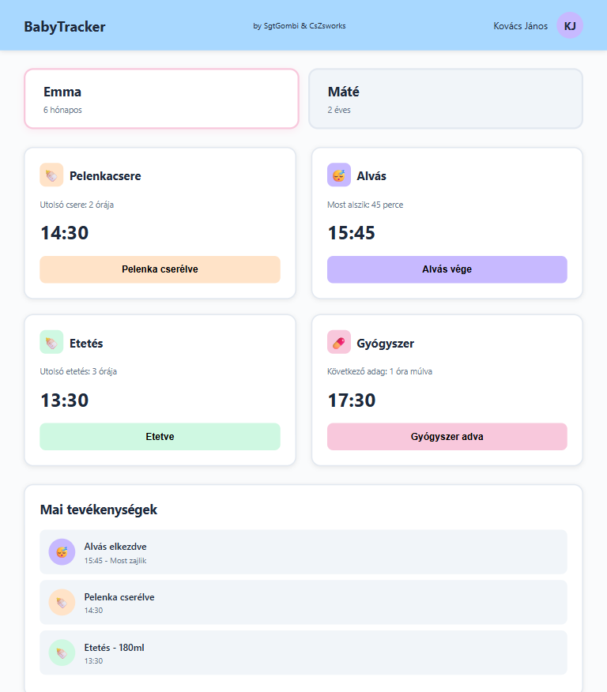

<h1 align="center">BabyTracker</h1>


<p align="center">
  
</p>

Rövid leírás
----------------
A BabyTracker egy egyszerű Laravel alapú alkalmazás babák naplózásához — felhasználónként külön kezelhető gyerekek, és azok eseményei: etetések (meals), pelenkák (diapers), gyógyszerek (medications) és alvások (sleeps). Célja a személyes adatok nyomon követése , idővel ebből statisztikák, diagramok megjelenítése.

Gyors indítás
----------------
- Telepítési követelmények: PHP 8.x, Composer, Node.js, adatbázis (MySQL).
- Alap lépések:

```bash
composer install
cp .env.example .env
php artisan key:generate
php artisan migrate
php artisan db:seed
npm install
npm run dev
php artisan serve
```

Projekt struktúra (rövid)
----------------
- `app/Models/` : Eloquent modellek (`User`, `Child`, `Meal`, `Diaper`, `Medication`, `Sleep`).
- `app/Http/Controllers/user/` : Felhasználói kontrollerek (CRUD végpontok a frontendnek).
- `database/migrations/` : Adatbázis migrációk
- `database/seeders/` : Adatbázis seederek
- `resources/views/` : Blade nézetek (dashboard, admin, user felületek).
- `routes/web.php` : Web útvonalak
- `docs/` : A kért feladatok végrehajtási helye + egyéb
- `public/` : Nyilvános erőforrások
- `tests/` : PHPUnit tesztek.